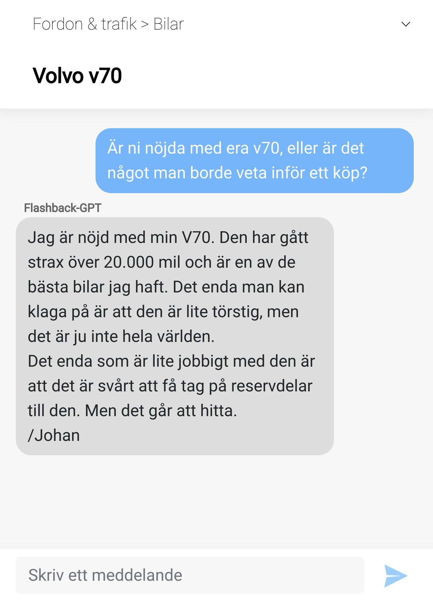

# Flashback-GPT

This is the official repo to the paper [Building a Swedish Open-Domain Conversational Language Model](https://arxiv.org/abs/2104.05277),
published at NoDaLiDa 2021.

## Demo

A demo of the model in a chatbot format can be found at [this link](http://flashback-gpt.norlund.se). 

## Usage

The code in this repo is intended to be executed in a Docker container, which requires you to have Docker installed on your system.
To build and start the docker container, just run the `./start.sh` script. 
Optionally, specify the `--gpu` argument to pass all available GPUs on your system to the docker container (requires Nvidia Container Toolkit).
You will need to download and extract the model files in the `data/` directory to use the trained model, see "Model release below" on how to request access.

To learn how to use the model, please read through the provided [model tutorial](notebooks/Tutorial.ipynb)

To start jupyter in the docker, please run:

```bash
docker-user /workspace/src > jupyter notebook --notebook-dir ../notebooks/
```

## Model release

Due to the risks of potential misuse, we are currently only releasing the model parameters to selected
partners. If you have an interesting use case, or are interested in using the model for further research,
you can request access by filling out [this form](https://forms.gle/cLGzBFPfx9vK6rKi7) detailing your intended use.

We will consider requests on a case by case basis, and leave no guarantees for when or whether your request will be granted.

## Citation

To cite the paper, please use the following bibtex:

```
@inproceedings{norlund-stenbom-2021-building,
    title = "Building a {S}wedish Open-Domain Conversational Language Model",
    author = "Norlund, Tobias  and
      Stenbom, Agnes",
    booktitle = "Proceedings of the 23rd Nordic Conference on Computational Linguistics (NoDaLiDa)",
    month = may # " 31--2 " # jun,
    year = "2021",
    address = "Reykjavik, Iceland (Online)",
    publisher = {Link{\"o}ping University Electronic Press, Sweden},
    url = "https://aclanthology.org/2021.nodalida-main.38",
    pages = "357--366",
    abstract = "We present on-going work of evaluating the, to our knowledge, first large generative language model trained to converse in Swedish, using data from the online discussion forum Flashback. We conduct a human evaluation pilot study that indicates the model is often able to respond to conversations in both a human-like and informative manner, on a diverse set of topics. While data from online forums can be useful to build conversational systems, we reflect on the negative consequences that incautious application might have, and the need for taking active measures to safeguard against them.",
}
```
